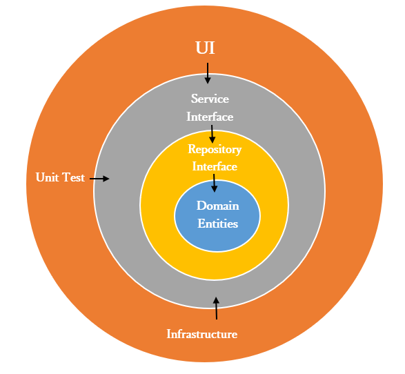

# MOVIE INC APP

Amazing app to explore your favorites movies, building in  React Native.

## Screenshots

## Features Implemted

- FF1: Movie List
- FF2: Movie Detail
- FF3: Add Movie Rating
- FF4: Similar and Recommended Movies
- FF4: Favorities Movies

## Architecture & Patterms

### Modules 

- App folder: Functional features in the app.

    | App Modules      |Notes                      |
    |------------------|--------------------------| 
    | @core            | Domain Logic and Data Access |      
    | @shared          | Function, hooks, utils, around the app modules except @core |   
    | @ui-components   |  UI Library/Module to use around the app modules with Atomic Design Pattern (it can be found inside shared folder)|        
    | @authentication  | Logics and components related with the authentication in the app |      
    | @movies          | Logics and components related with the Movie in the app | 

    Note: The app modules in the table are in dependency order, Authentication and movies  do not depend on each other.

- Libs folder: Custom implementation for external libraries (D of SOLID), or custom functionalities.

    | Libs Modules      |Notes                      |
    |------------------|--------------------------|
    | @translations    | Custom implementation for translation library (react-i18nex)|  

### Highlights

- For The naming convention and The modules and files locations the choice was the Angular Guide Style.

- For get a better organization of the components and apply the S of SOLID I used the Atomic design.

- The Core module organization was inspired by the Onion Architecture.

  

### Highlight Libraries

| Target            |Name                      |Notes |
|-------------------|--------------------------|------|
| State Maganement  | Redux                    |For me it's the best library/patterm to handle global state| 
| Navigation        | React Navigation         |      | 
| Unit Tests        | Jest and Testing Library |      | 
| Styling           | Styled Componet          |      | 
| Tanslations       | react-i18next         |      | 

## Previous requirements

- Nodejs
- Expo

## Configuration

Create .env file and add the value for the follow  variables

    EXPO_PUBLIC_API_URL=https://api.themoviedb.org/3
    EXPO_PUBLIC_IMAGE_URL_BASE=https://image.tmdb.org/t/p/original
    EXPO_PUBLIC_AUTH_TOKEN=eyxxxxxxxxxxx

## Run

We only need run:

    yarn start

## Test

We only need run:

    yarn test

### Current Coverage 

| File   |      % Stmts      |  % Branch | % Funcs | % Lines |
|----------|:-------------:|------:|------:|------:|
| All files  |  92.7  |   80.32 | 91.37 |93.04|

## References

- [Angular Style Guide ](https://angular.io/guide/styleguide)
- [UI Design](https://dribbble.com/shots/5529233-Movie-App-Interface-Design-Dark-Theme)
- [Atomic design](https://bradfrost.com/blog/post/atomic-web-design/)
- [Onion Architecture](https://jeffreypalermo.com/2008/07/the-onion-architecture-part-1/)
- [TMDB](https://developer.themoviedb.org/docs/getting-started)